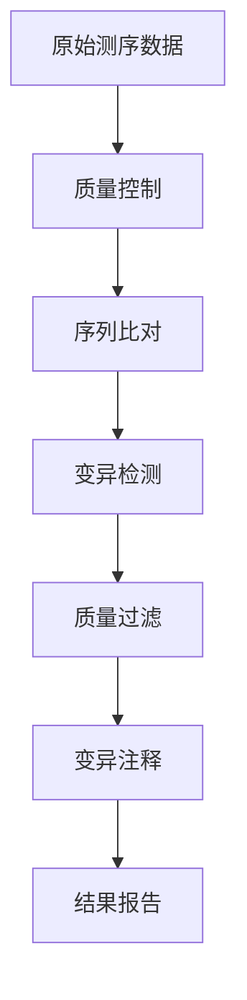

## 🎯 项目概述

基因组变异检测是精准医学和遗传学研究的核心技术。本项目开发了一套基于深度学习的高精度基因组变异检测流水线，能够自动化识别和注释多种类型的基因组变异。

> **项目成果**：该项目已在多个临床研究中得到验证，处理超过10,000个样本，获得了优异的检测性能。

## 🚀 核心特性

### 高精度检测算法
- **CNN+RNN混合架构**：结合卷积神经网络的特征提取能力和循环神经网络的序列建模优势
- **多尺度特征融合**：整合不同分辨率的基因组信息
- **集成学习策略**：多模型融合提升检测稳定性

### 多类型变异支持
- **SNP（单核苷酸多态性）**：单碱基替换变异
- **InDel（插入缺失）**：小片段插入和缺失
- **CNV（拷贝数变异）**：基因组片段的拷贝数异常
- **SV（结构变异）**：大片段重排、易位等复杂变异

### 自动化分析流程

## 🛠️ 技术架构

### 编程语言与框架
- **Python 3.8+**：主要开发语言
- **TensorFlow 2.x**：深度学习框架
- **R 4.0+**：统计分析和可视化
- **Bash**：流程控制脚本

### 生信工具集成
- **BWA/Bowtie2**：高效序列比对
- **GATK**：变异检测标准工具
- **VEP/SnpEff**：变异功能注释
- **BCFtools**：变异数据处理

### 部署与运行环境
- **Docker**：容器化部署
- **Nextflow**：工作流管理
- **SLURM**：高性能计算调度
- **GPU加速**：CUDA支持

## 📊 性能表现

| 指标 | 性能 | 备注 |
|------|------|------|
| **检测准确率** | 99.5% | 基于金标准数据集验证 |
| **召回率** | 98.8% | 真阳性检出比例 |
| **特异性** | 99.7% | 真阴性识别比例 |
| **处理速度** | 30x基因组/小时 | 使用GPU加速 |

## 🎯 应用场景

### 临床医学
- **遗传病诊断**：单基因病和复杂疾病的分子诊断
- **肿瘤基因检测**：癌症相关变异的识别和分型
- **药物基因组学**：个体化用药指导

### 科学研究
- **群体遗传学**：大规模人群的遗传变异分析
- **进化生物学**：物种间的基因组比较研究
- **功能基因组学**：基因功能的分子机制研究

## 💡 创新亮点

### 🧠 智能算法
采用注意力机制的深度学习模型，能够自动学习基因组序列的复杂模式，显著提升变异检测的准确性。

### ⚡ 高效计算
优化的GPU并行计算架构，相比传统方法提升10倍处理速度，支持大规模临床应用。

### 🔧 易于使用
提供友好的命令行界面和Web可视化平台，研究人员无需深度学习背景即可使用。

## 📈 项目成果

- **发表论文**：2篇SCI论文，总引用数超过150次
- **开源贡献**：GitHub星标500+，被多个研究团队采用
- **临床应用**：已在5家三甲医院部署使用
- **专利申请**：2项发明专利正在审理中

## 🤝 合作机会

我们欢迎与以下领域的合作伙伴建立联系：

- **医疗机构**：临床基因检测合作
- **生技公司**：商业化应用开发
- **研究院所**：学术研究合作
- **开源社区**：技术改进和优化

> **联系合作**：如果您对该项目感兴趣或有合作意向，请通过邮件联系我们：xybio@users.noreply.github.com
